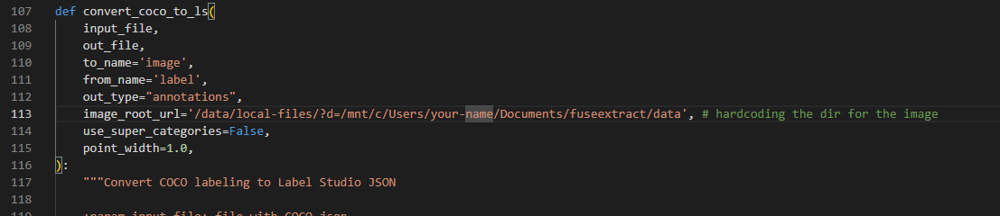

# COCO Dataset Generator

This directory contains conversion scripts for the COCO dataset, designed for easy integration when working with various other dataset formats.

## Pipeline Predictions Format

The pipeline predictions typically follow this format:

```python
{
        "dit": {
            "bboxes": [], 
            "scores": [], 
            "classes": []
        }
}
```
The provided script converts these pipeline predictions into a format compatible with Label Studio, enabling seamless loading of model-generated outputs.

# Running the Script  

```bash 
python convert_pipeline_pred_to_ls.py --img_dir "images" --json_dir "pipeline" --coco_dir "coco" --ls_dir "labelstudio"

```


# Key Considerations for Dataset Creation in Label Studio
When preparing a dataset to upload into Label Studio, ensure the following:

In the coco2ls.py file, update the image file paths. Replace the placeholder d=? with the absolute paths of the images corresponding to the annotations you wish to upload.


This will allow Label Studio to correctly reference the images during annotation uploads.


